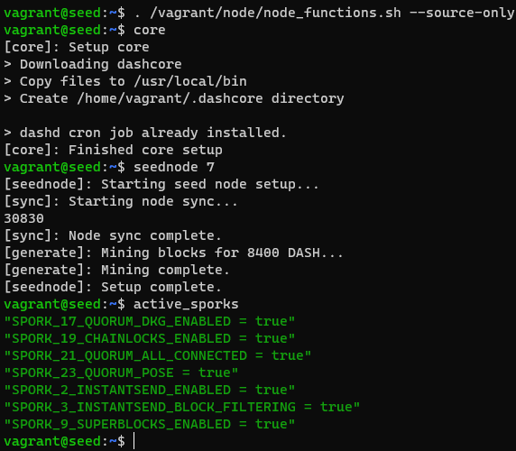
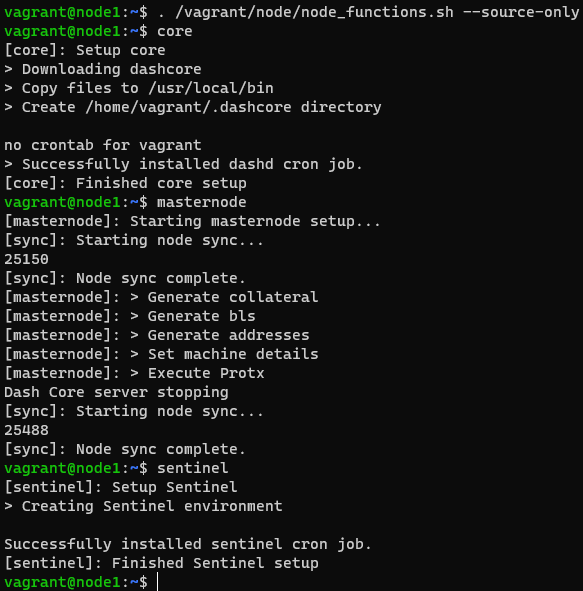

# Virtual Machine Setup

## Prerequisites

- Vagrant 2.2.19 +
- VirtualBox 6.1.32 +

## Basic Commands

```bash
# CLONE REPO
git clone <this repo>
cd <this repo>

# CREATE VAGRANT VMs
vagrant up

# SSH INTO VMs
vagrant ssh <node name>

```

## INSIDE VMs

```bash
# MAKE FUNCTION GLOBAL
. /vagrant/node/node_functions.sh --source-only
```

```bash
# FUNCTIONS

## Install all dash dependencies
core

## seednode => provides funds to the masternodes
seednode <number-of-masternodes>

## make node to masternode
masternode

## install sentinel for masternode
sentinel

## activate all sporks (DIPs)
active_sporks

## list all ips of masternodes
masternode_list

```

 

- setup time for 8 machines on windows with ryzen 7 5800x and 32gb RAM: 00:20:49

---

## Vagrant and Virtual Machines

### Initialize Project Directory

`vagrant init ubuntu/focal64`

- vagrant uses base images to clone VMs
- base images are called boxes, hence *ubuntu/focal64* is a box
- places all necessary files in the current directory
- `Vagrantfile` has all information about the VMs

### Boot an Environment and SSH into a machine

`vagrant up`

- after initialisation one can boot vagrant environment
- configuring the virtual machines depending on specified information in the `Vagrantfile`
- `==> default: Machine booted and ready!` is printed after the machine is started and ready to be used

`vagrant ssh <name>`

- usind the ssh command will allow to connect to the virtual machine
- inside the virtual machine use logout to exit correctly the ssh connection

```bash
$ vagrant ssh vagrant
Welcome to Ubuntu 20.04.4 LTS (GNU/Linux 5.4.0-105-generic x86_64)

 * Documentation:  https://help.ubuntu.com
 * Management:     https://landscape.canonical.com
 * Support:        https://ubuntu.com/advantage

  System information as of Wed Apr  6 09:00:41 UTC 2022

  System load:  1.43              Processes:               121
  Usage of /:   3.4% of 38.71GB   Users logged in:         0
  Memory usage: 20%               IPv4 address for enp0s3: 10.0.2.15
  Swap usage:   0%


1 update can be applied immediately.
To see these additional updates run: apt list --upgradable


The list of available updates is more than a week old.
To check for new updates run: sudo apt update

vagrant@ubuntu-focal:~$ 
```

### Destroy and Remove Environment

`vagrant destory`

- removes all resource created by a virtual machine
- confirm prompt with `y` to remove the data

`vagrant box list` + `vagrant box remove ubuntu/focal64`

- boxes can be removed by box remove + name

### Shared files

- vagrant share project directory and is under `/vagrant` inside the virtual machine
- printing the contents of the directory should show all files in the project directory

### Stop machines

`vagrant halt`

- attempts to shut down guest OS and power down the machine
- it is a clean shut down preserve information on the disk
